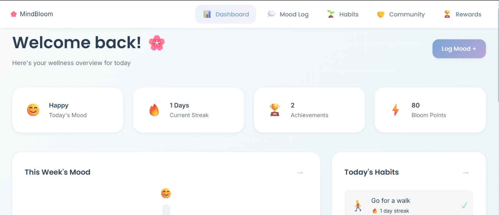
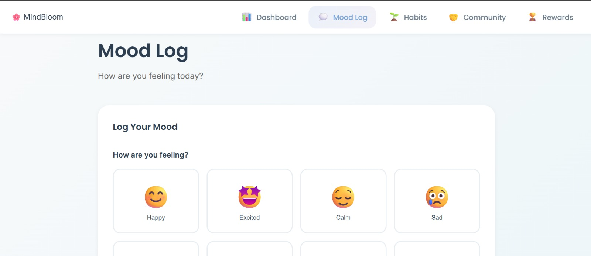
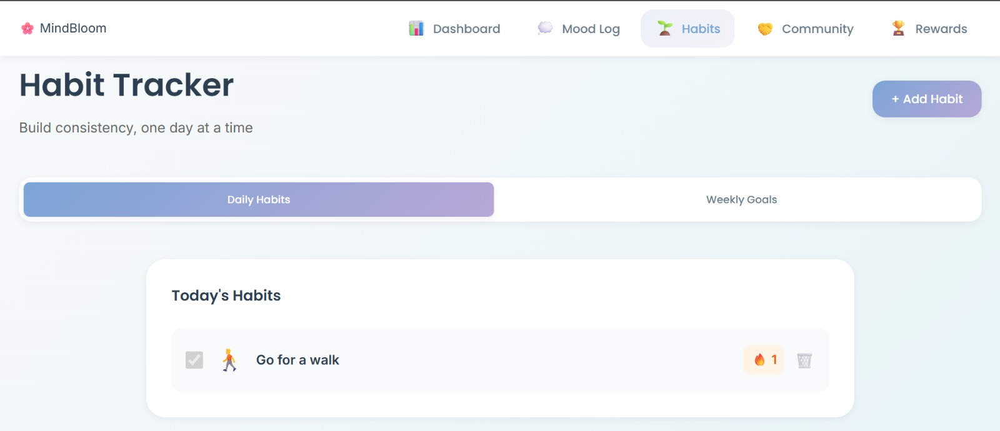
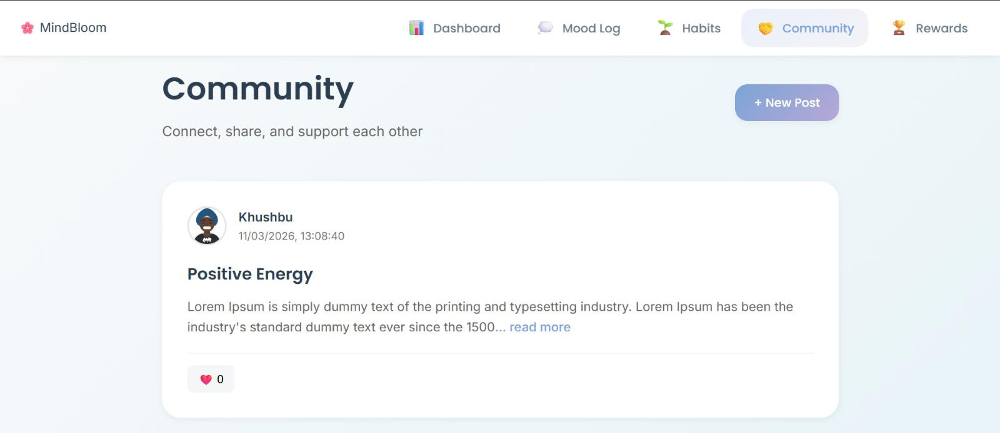
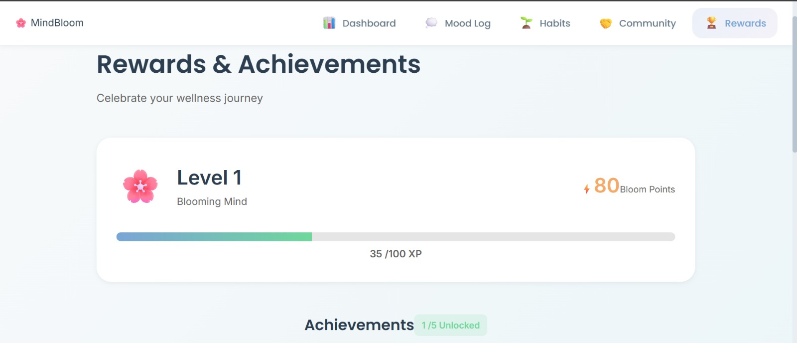

# 🌸 MindBloom – Mental Wellness Tracker

MindBloom is a full-stack mental wellness web application that helps users track their emotions, build healthy habits, and engage with a supportive community.

Users can log their mood, maintain habit streaks, share anonymous posts, and unlock achievements while improving their mental wellness journey.

---

# 🚀 Live Demo

Frontend (Netlify) : 
https://k-mindbloom.netlify.app

Backend API (Render) : 
https://mindbloom-er4l.onrender.com

---

# 📸 Project Screenshots

## Dashoard


## Mood Logs


## Habit Tracker


## Community


## Rewards


---

# ✨ Features

### 🌤 Mood Tracking
- Log daily mood with emoji and notes
- Weekly mood visualization
- Helps identify emotional patterns

### 🌱 Habit Tracker
- Create daily or weekly habits
- Track habit streaks
- Edit and delete habits
- Automatic reset for daily and weekly habits

### 🤝 Community
- Anonymous community posts
- Like posts to support others
- Expand long posts with Read More

### 🏆 Rewards & Achievements
- Earn Bloom Points
- Unlock achievements
- Track progress toward new rewards

### 📊 Dashboard Overview
- Today's mood summary
- Habit progress
- Recent achievements
- Quick action shortcuts

---

# 🛠 Tech Stack

### Frontend
- React
- Vite
- CSS
- Fetch API

### Backend
- Node.js
- Express.js
- MongoDB Atlas
- Mongoose

### Deployment
- Netlify (Frontend)
- Render (Backend)

---

# 📂 Project Structure
```
MindBloom
│
├── backend
│   ├── models
│   ├── routes
│   ├── server.js
│   └── package.json
│
├── frontend
│   ├── src
│   │   ├── components
│   │   ├── styles
│   │   ├── App.jsx
│   │   └── main.jsx
│   │
│   └── package.json
│
└── README.md
```
---

# ⚙️ Local Installation

1️⃣ Clone Repository
```
git clone https://github.com/Khushbu696/MindBloom.git
cd MindBloom
```

2️⃣ Backend Setup
```
cd backend
npm install
```
Create .env
```
MONGO_URI=your_mongodb_connection_string
JWT_SECRET=your_secret_key
JWT_EXPIRES_IN=7d
```
Run Backend
```
npm start
```

3️⃣ Frontend Setup
```
cd frontend
npm install
npm run dev
```

---

# 📈 Future Improvements
- Community replies and comments
- Mood analytics charts
- Guided meditation section
- Notification reminders
- Mobile UI improvements
- User profile customization